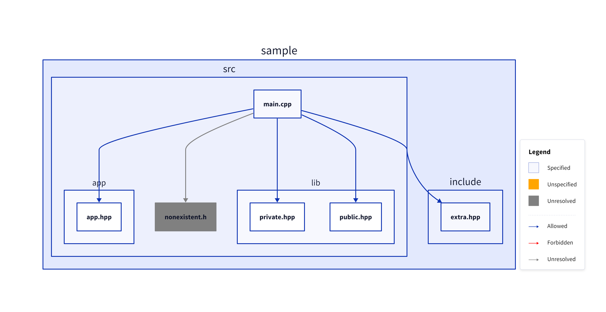
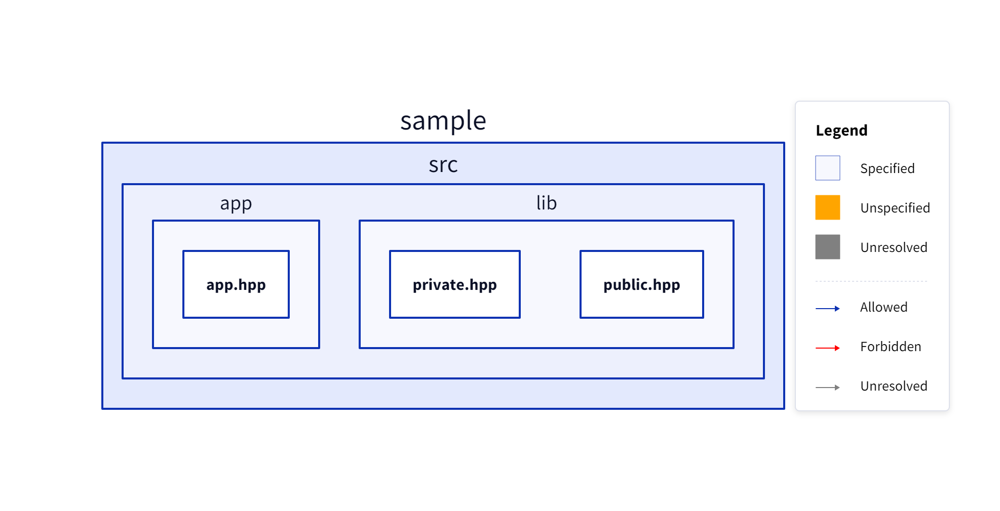
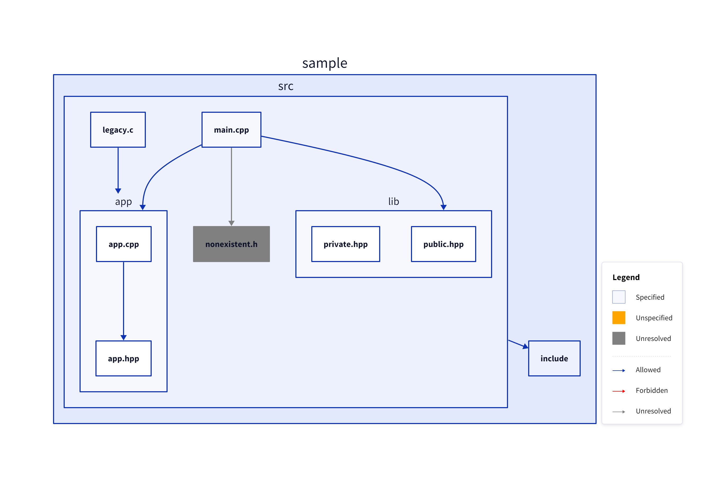
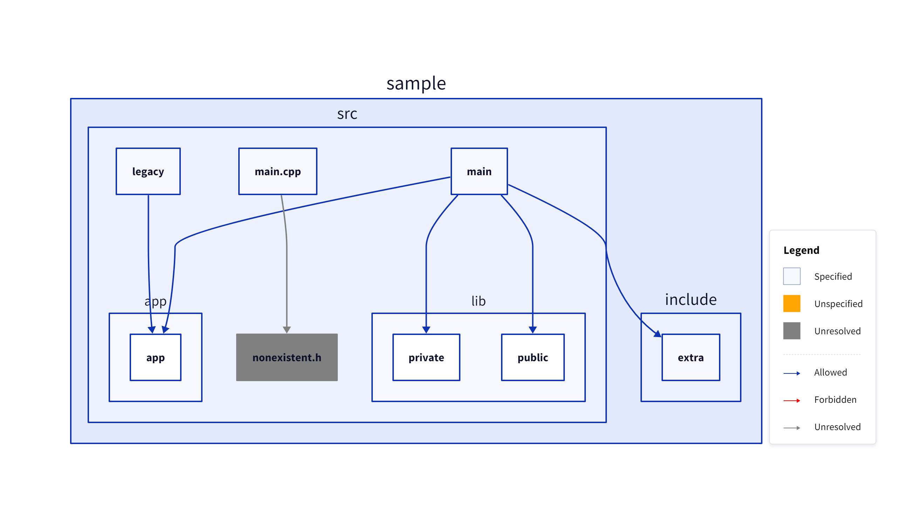
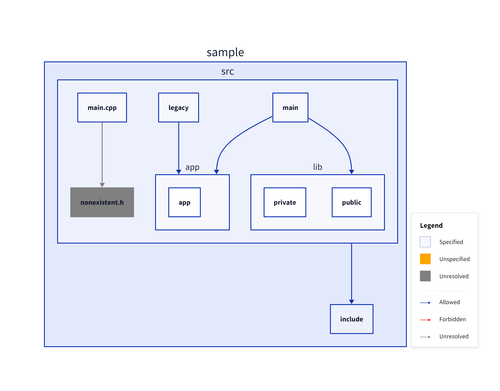

# CppDepScan

## Description

C++ include detection: scan globs, resolve `#include` directives, and output the include graph as JSON and/or [D2](https://d2lang.com/).

## Features

- Scan C/C++ sources (`.c`, `.cc`, `.cpp`, `.cxx`, `.h`, `.hpp`, `.hxx`, `.hh`)
- Glob-aware path matching for scan/exclude/allowed/group rules (`*`, `**`)
- Resolve `#include "..."` and `#include <...>` using the current folder and configurable include paths
- Exclude globs from scanning; force-include with `-e !<glob>`
- Declare allowed includes (`-a`) for dependency rules
- Output as **JSON** or **D2**, to files and/or stdout
- Track allowed, forbidden, and unresolved include relationships
- Optional grouping by glob (`-g`), source/header pairing (`--group-source-header`), sibling-style links (`--brother-links`), and standard library headers in output (`--std`)

## Planned Features

For ideas on upcoming CLI options and behaviors, see [`PLANNED_FEATURES.md`](PLANNED_FEATURES.md).

## Examples

All examples below use the `sample/` directory and write under `result/`. On Windows use `CppDepScan.exe` instead of `CppDepScan`.

### Basic scan (D2 to file)

```bash
CppDepScan sample -o result/basic.d2
```

<details>
<summary>D2 output</summary>

```d2
classes: {
  forbidden: {
    style: {
      stroke: "red"
    }
  }
  unspecified: {
    style: {
      stroke: "orange"
      fill: "orange"
    }
  }
  unresolved: {
    style: {
      stroke: "gray"
      fill: "gray"
    }
  }
}
vars: {
  d2-legend: {
    a: {
      label: Specified
    }
    b: Unspecified {
      label: Unspecified
      class: unspecified
    }
    c: Unresolved {
      label: Unresolved
      class: unresolved
    }
    a -> b: Allowed
    a -> b: Forbidden {
      class: forbidden
    }
    a -> b: Unresolved {
      class: unresolved
    }
  }
}

# specified include list:

# files:
sample.build."junk.cpp"
sample.external."skip.cpp"
sample.external.keep."keep.cpp"
sample.external.keep."keep.hpp"
sample.include."extra.hpp"
sample.src."legacy.c"
sample.src."main.cpp"
sample.src.app."app.cpp"
sample.src.app."app.hpp"
sample.src.lib."private.hpp"
sample.src.lib."public.hpp"

# allowed:
sample.external.keep."keep.cpp" -> sample.external.keep."keep.hpp"
sample.src."legacy.c" -> sample.src.app."app.hpp"
sample.src."main.cpp" -> sample.src.app."app.hpp"
sample.src."main.cpp" -> sample.src.lib."private.hpp"
sample.src."main.cpp" -> sample.src.lib."public.hpp"
sample.src.app."app.cpp" -> sample.src.app."app.hpp"

# forbidden:

# unresolved:
sample.build."nothing.hpp".class: unresolved
sample.build."junk.cpp" -> sample.build."nothing.hpp": {class: unresolved}
sample.src."extra.hpp".class: unresolved
sample.src."main.cpp" -> sample.src."extra.hpp": {class: unresolved}
sample.src."nonexistent.h".class: unresolved
sample.src."main.cpp" -> sample.src."nonexistent.h": {class: unresolved}
```

</details>

<details open>
<summary>Rendered image</summary>


</details>

### Exclude globs (`-e`)

```bash
CppDepScan sample -e sample/build -e sample/external -o result/exclude_build_external.d2
```

<details>
<summary>D2 output</summary>

```d2
# specified include list:

# files:
sample.include."extra.hpp"
sample.src."legacy.c"
sample.src."main.cpp"
sample.src.app."app.cpp"
sample.src.app."app.hpp"
sample.src.lib."private.hpp"
sample.src.lib."public.hpp"

# allowed:
sample.src."legacy.c" -> sample.src.app."app.hpp"
sample.src."main.cpp" -> sample.src.app."app.hpp"
sample.src."main.cpp" -> sample.src.lib."private.hpp"
sample.src."main.cpp" -> sample.src.lib."public.hpp"
sample.src.app."app.cpp" -> sample.src.app."app.hpp"

# forbidden:

# unresolved:
sample.src."extra.hpp".class: unresolved
sample.src."main.cpp" -> sample.src."extra.hpp": {class: unresolved}
sample.src."nonexistent.h".class: unresolved
sample.src."main.cpp" -> sample.src."nonexistent.h": {class: unresolved}
```

</details>

<details>
<summary>Rendered image</summary>


</details>

### Exclude with keep (`-e !<glob>`)

```bash
CppDepScan sample -e sample/build -e sample/external -e !sample/external/keep -o result/exclude_build_external_keep.d2
```

<details>
<summary>Rendered image</summary>


</details>

### Include paths (`-i`)

```bash
CppDepScan sample/src -i sample/include -o result/include.d2
```

<details>
<summary>Rendered image</summary>


</details>

### Scan glob (`*`)

```bash
CppDepScan 'sample/src/*' -i sample/include -o result/include_glob_scan.d2
```

<details>
<summary>Rendered image</summary>



</details>

### Scan glob with recursion (`**`)

```bash
CppDepScan 'sample/src/**/*.hpp' -i sample/include -o result/include_glob_recursive_scan.d2
```

<details>
<summary>Rendered image</summary>



</details>

### Allowed includes (`-a`, `--allowed`)

```bash
CppDepScan sample/src -i sample/include -a sample/src/main.cpp sample/src/app -a sample/src/main.cpp sample/include -a sample/src/legacy.c sample/src/app -o result/allowed.d2
```

<details open>
<summary>Rendered image</summary>


</details>

**Note**: When at least one allowed rule is specified, all files not described by an allowed rule are considered **unspecified**. If you don't want a file to include anything, just add a rule with an invalid, empty or itself as allowed glob (e.g. `-a sample/src/legacy.c ''`).

### Grouping (`-g`, `--group`)

```bash
CppDepScan sample -e sample/build -e sample/external -i sample/include -g sample/include -g sample/external -g sample/src -o result/group.d2
```

<details>
<summary>D2 output</summary>

```d2
# specified include list:

# files:
sample.external
sample.include
sample.src

# allowed:
sample.src -> sample.include

# forbidden:

# unresolved:
```

</details>

<details>
<summary>Rendered image</summary>


</details>

### Brother links (`--brother-links`)

```bash
CppDepScan sample/src -i sample/include --brother-links -o result/brother_links.d2
```

<details>
<summary>Rendered image</summary>



</details>

### Group source with header (`--group-source-header`)

```bash
CppDepScan sample/src -i sample/include --group-source-header -o result/group_source_header.d2
```

<details>
<summary>D2 output</summary>

```d2
# specified include list:

# files:
sample.src."main.cpp"
sample.src.app.app
sample.src.legacy
sample.src.lib.private
sample.src.lib.public
sample.src.main

# allowed:
sample.src.legacy -> sample.src.app.app
sample.src.main -> sample.include.extra
sample.src.main -> sample.src.app.app
sample.src.main -> sample.src.lib.private
sample.src.main -> sample.src.lib.public

# forbidden:

# unresolved:
sample.src."nonexistent.h".class: unresolved
sample.src."main.cpp" -> sample.src."nonexistent.h": {class: unresolved}
```

</details>

<details>
<summary>Rendered image</summary>



</details>

Works well with `--brother-links`:

```bash
CppDepScan sample/src -i sample/include --group-source-header --brother-links -o result/group_source_header_brother_links.d2
```

<details>
<summary>Rendered image</summary>



</details>

### Standard library in output (`--std`)

```bash
CppDepScan sample/src sample/external -i sample/include -g sample/src -g sample/external --std -o result/std.d2
```

<details>
<summary>D2 output</summary>

```d2
# specified include list:

# files:
sample.external
sample.src
sample.src."main.cpp"

# allowed:
sample.external -> cstdio
sample.src -> iostream
sample.src -> sample.include."extra.hpp"

# forbidden:

# unresolved:
sample.src."nonexistent.h".class: unresolved
sample.src."main.cpp" -> sample.src."nonexistent.h": {class: unresolved}
```

</details>

<details>
<summary>Rendered image</summary>


</details>

### JSON output

```bash
CppDepScan sample/src -i sample/include -o result/include.json
```

<details>
<summary>JSON output</summary>

```json
{
	"specifiedIncludeMap": {
		"sample.src.\"legacy.c\"": {
			"allowedSet": ["sample.src.app.\"app.hpp\""],
			"forbiddenSet": [],
			"unresolvedSet": []
		},
		"sample.src.\"main.cpp\"": {
			"allowedSet": [
				"sample.include.\"extra.hpp\"",
				"sample.src.app.\"app.hpp\"",
				"sample.src.lib.\"private.hpp\"",
				"sample.src.lib.\"public.hpp\""
			],
			"forbiddenSet": [],
			"unresolvedSet": ["sample.src.\"nonexistent.h\""]
		},
		"sample.src.app.\"app.cpp\"": {
			"allowedSet": ["sample.src.app.\"app.hpp\""],
			"forbiddenSet": [],
			"unresolvedSet": []
		},
		"sample.src.app.\"app.hpp\"": { "allowedSet": [], "forbiddenSet": [], "unresolvedSet": [] },
		"sample.src.lib.\"private.hpp\"": { "allowedSet": [], "forbiddenSet": [], "unresolvedSet": [] },
		"sample.src.lib.\"public.hpp\"": { "allowedSet": [], "forbiddenSet": [], "unresolvedSet": [] }
	},
	"unspecifiedIncludeMap": {}
}
```

</details>

### Exclude unresolved path (bad practice)

Excluding a path that is only ever seen as unresolved hides the missing include from the graph.

```bash
CppDepScan sample -e sample/src/extra.hpp -o result/exclude_unresolved.d2
```

<details>
<summary>D2 output</summary>

```d2
# specified include list:

# files:
sample.build."junk.cpp"
sample.external."skip.cpp"
sample.external.keep."keep.cpp"
sample.external.keep."keep.hpp"
sample.include."extra.hpp"
sample.src."legacy.c"
sample.src."main.cpp"
sample.src.app."app.cpp"
sample.src.app."app.hpp"
sample.src.lib."private.hpp"
sample.src.lib."public.hpp"

# allowed:
sample.external.keep."keep.cpp" -> sample.external.keep."keep.hpp"
sample.src."legacy.c" -> sample.src.app."app.hpp"
sample.src."main.cpp" -> sample.src.app."app.hpp"
sample.src."main.cpp" -> sample.src.lib."private.hpp"
sample.src."main.cpp" -> sample.src.lib."public.hpp"
sample.src.app."app.cpp" -> sample.src.app."app.hpp"

# forbidden:

# unresolved:
sample.build."nothing.hpp".class: unresolved
sample.build."junk.cpp" -> sample.build."nothing.hpp": {class: unresolved}
sample.src."nonexistent.h".class: unresolved
sample.src."main.cpp" -> sample.src."nonexistent.h": {class: unresolved}
```

</details>

<details>
<summary>Rendered image</summary>


</details>

### Exclude after resolve (good practice)

Resolve with `-I` then exclude the file so the edge appears as allowed and the file is hidden from the graph.

```bash
CppDepScan sample -i sample/include -e sample/include/extra.hpp -o result/exclude_include.d2
```

<details>
<summary>D2 output</summary>

```d2
# specified include list:

# files:
sample.build."junk.cpp"
sample.external."skip.cpp"
sample.external.keep."keep.cpp"
sample.external.keep."keep.hpp"
sample.src."legacy.c"
sample.src."main.cpp"
sample.src.app."app.cpp"
sample.src.app."app.hpp"
sample.src.lib."private.hpp"
sample.src.lib."public.hpp"

# allowed:
sample.external.keep."keep.cpp" -> sample.external.keep."keep.hpp"
sample.src."legacy.c" -> sample.src.app."app.hpp"
sample.src."main.cpp" -> sample.src.app."app.hpp"
sample.src."main.cpp" -> sample.src.lib."private.hpp"
sample.src."main.cpp" -> sample.src.lib."public.hpp"
sample.src.app."app.cpp" -> sample.src.app."app.hpp"

# forbidden:

# unresolved:
sample.build."nothing.hpp".class: unresolved
sample.build."junk.cpp" -> sample.build."nothing.hpp": {class: unresolved}
sample.src."nonexistent.h".class: unresolved
sample.src."main.cpp" -> sample.src."nonexistent.h": {class: unresolved}
```

</details>

<details>
<summary>Rendered image</summary>


</details>

### Group ignored for forbidden, unresolved or unspecified

When an include is forbidden, unresolved or unspecified, the edge is still shown from the specified file; grouping does not attach it to the group node.

```bash
CppDepScan sample/src -g sample/src -i sample/include -a sample/src/main.cpp sample/src -a sample/src/app sample/src/app -a sample/src/lib sample/src/lib -o result/ignored_group.d2
```

<details>
<summary>Rendered image</summary>


</details>

## Usage

```
CppDepScan [options] <scan_glob> [scan_glob ...]
```

**Scan globs**

| Option       | Description                                                   |
| ------------ | ------------------------------------------------------------- |
| `-e <glob>`  | Exclude glob for scanning (folder, file, or pattern); repeat. |
| `-e !<glob>` | Keep glob for scanning even if it lies under an exclude.      |

- **Scan globs** (positional): file, directory, or glob inputs to scan for C/C++ sources (`.c`, `.cc`, `.cpp`, `.cxx`, `.h`, `.hpp`, `.hxx`, `.hh`).
- **Exclude** (`-e`): file, directory, or glob pattern to skip during scan. Use `-e !<glob>` to force-include a glob that would otherwise be excluded.

**Resolution**

| Option                        | Description                                                                |
| ----------------------------- | -------------------------------------------------------------------------- |
| `-i <path>`                   | Add include path for resolution (folder or file); may be repeated.         |
| `-a`, `--allowed <from> <to>` | Specify that `<from>` may include `<to>`; both are globs; may be repeated. |

- **Include paths** (`-i`): used to resolve `#include "..."` and `#include <...>`. The current file's directory is always tried first for `"..."`.
- **Allowed** (`-a`): declare that `<from>` may include `<to>`; both values are globs and are reflected in the dependency rules and D2/JSON output.

**Output**

| Option                  | Description                                                                                  |
| ----------------------- | -------------------------------------------------------------------------------------------- |
| `-o <file>`             | Write output to file; may be repeated. `.json` → JSON, otherwise D2.                         |
| `--json`                | Use JSON for stdout (default when no `-o`: D2).                                              |
| `--brother-links`       | Make links always between elements in the same folder (default: false).                      |
| `--group-source-header` | Group each source file with its matching header (same base name) in output (default: false). |
| `--std`                 | Include standard library headers in output (default: false).                                 |
| `-g`, `--group <glob>`  | Gather files by group glob; may be repeated.                                                 |

- **JSON**: `specifiedIncludeMap` — object mapping each source file (dotted path) to an object with `allowedSet`, `forbiddenSet`, `unresolvedSet`; `unspecifiedIncludeMap` — same shape (e.g. headers only).
- **D2**: **# specified include list** / **# unspecified include list** — for each file, **# allowed:** edges `from -> to`, **# forbidden:** edges, **# unresolved:** commented-out edges for unresolved includes.
- **Exit status**: The process exits with `EXIT_SUCCESS` only if all includes are resolved and allowed (true if no `-a` is given) and all files specified (true if no `-a` is given), else the process exits with `EXIT_FAILURE`.
- **Glob syntax**: `*` matches within one path segment, `**` matches across segments.
  - **Note**: On Windows, **always single-quote glob patterns** in the command line (e.g., `'sample/src/*'`, `'sample/**/*.hpp'`) to prevent premature expansion or parsing errors.

**Other**

| Option         | Description |
| -------------- | ----------- |
| `-h`, `--help` | Print help. |

## Build

### Requirement

- C++17 compiler (e.g. GCC/Clang with `-std:c++17`, or MSVC with `/std:c++17`)

**Windows (cmd):**

```batch
build.bat
```

**Windows (manual), Git Bash, or WSL:**

```bash
g++ -std=c++17 -O2 -o CppDepScan.exe CppDepScan.cpp
```

**Linux / macOS:**

```bash
./build.sh
```

This produces `CppDepScan` (or `CppDepScan.exe` on Windows).

## License

MIT License. See [LICENSE](LICENSE).
