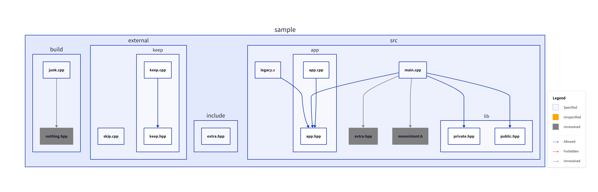
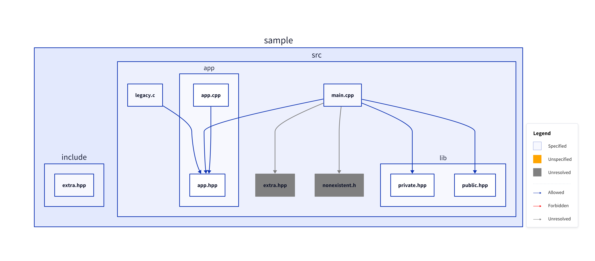
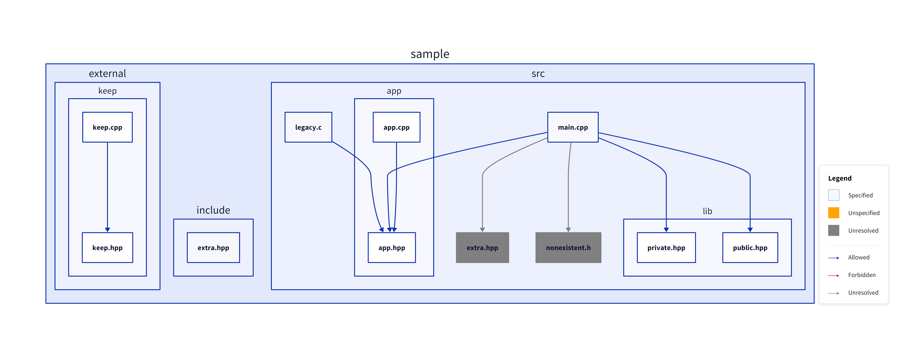
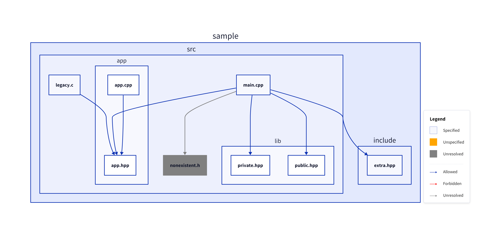
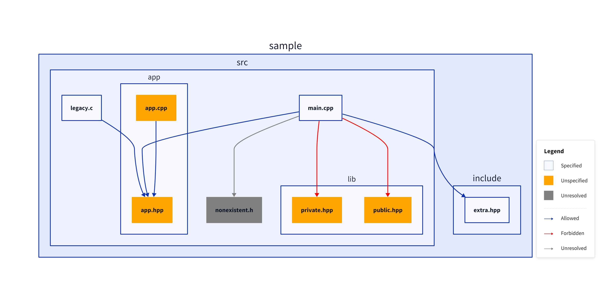
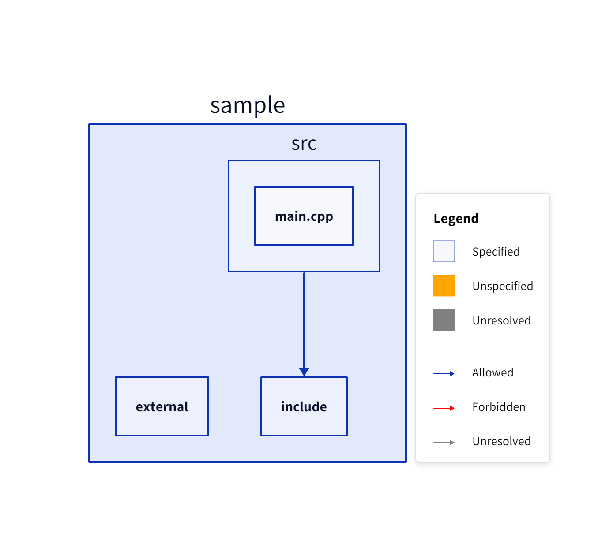
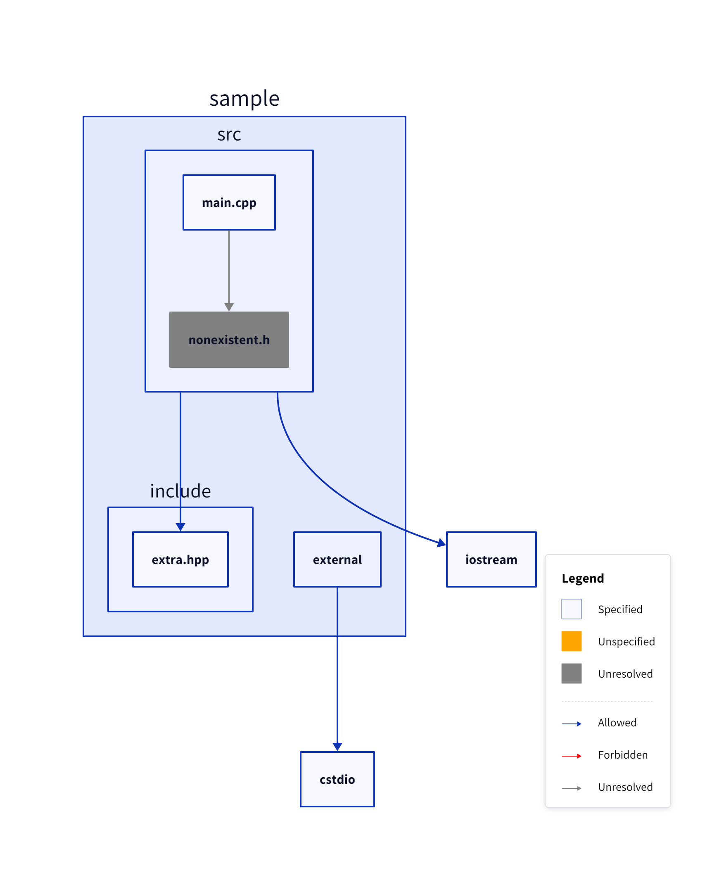
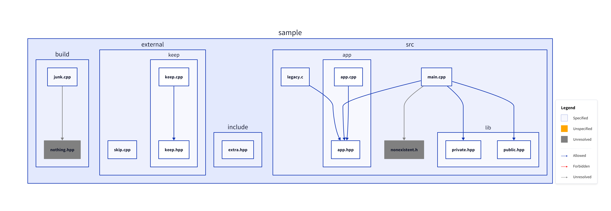
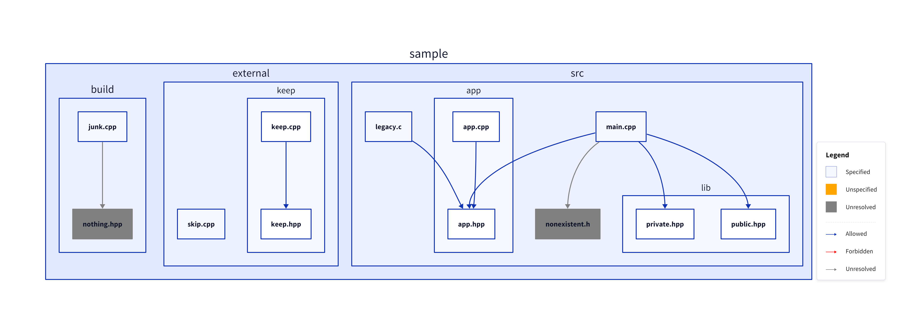
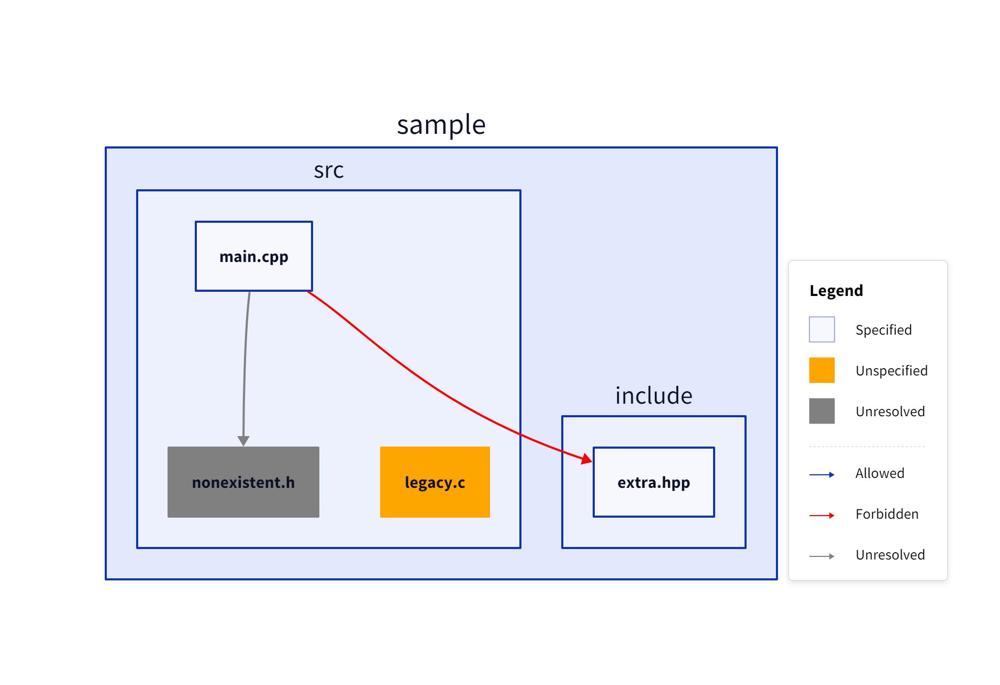

# CppDepScan

## Description

C++ include detection: scan paths, resolve `#include` directives, and output the include graph as JSON and/or [D2](https://d2lang.com/).

## Features

- Scan C/C++ sources (`.c`, `.cc`, `.cpp`, `.cxx`, `.h`, `.hpp`, `.hxx`, `.hh`, `.h++`)
- Resolve `#include "..."` and `#include <...>` with configurable include paths
- Exclude paths from scanning; force-include with `-e !<path>`
- Declare allowed includes (`-A`) for dependency rules
- Output as **JSON** (include maps with allowed/forbidden/unresolved sets) or **D2** (include list with edges)
- Optional grouping by path (`-g`) and optional standard library headers in output (`--std`)

## Examples

All examples below use the `sample/` directory and write under `result/`. On Windows use `CppDepScan.exe` instead of `CppDepScan`.

### Basic scan (D2 to file)

```bash
CppDepScan sample -o result/basic.d2
```

<details>
<summary>D2 output</summary>

```d2
classes: {
  forbidden: {
    style: {
      stroke: "red"
    }
  }
  unspecified: {
    style: {
      stroke: "orange"
	  fill: "orange"
    }
  }
  unresolved: {
    style: {
      stroke: "gray"
	  fill: "gray"
    }
  }
}
vars: {
  d2-legend: {
    a: { label: Specified }
    b: Unspecified { label: Unspecified; class: unspecified }
    c: Unresolved { label: Unresolved; class: unresolved }
    a -> b: Allowed
    a -> b: Forbidden { class: forbidden }
    a -> b: Unresolved { class: unresolved }
  }
}

# specified include list:
# files:
sample.build."junk.cpp"
sample.external."skip.cpp"
sample.external.keep."keep.cpp"
sample.external.keep."keep.hpp"
sample.include."extra.hpp"
sample.src."legacy.c"
sample.src."main.cpp"
sample.src.app."app.cpp"
sample.src.app."app.hpp"
sample.src.lib."private.hpp"
sample.src.lib."public.hpp"

# allowed:
sample.external.keep."keep.cpp" -> sample.external.keep."keep.hpp"
sample.src."legacy.c" -> sample.src.app."app.hpp"
sample.src."main.cpp" -> sample.src.app."app.hpp"
sample.src."main.cpp" -> sample.src.lib."private.hpp"
sample.src."main.cpp" -> sample.src.lib."public.hpp"
sample.src.app."app.cpp" -> sample.src.app."app.hpp"

# forbidden:
# unresolved:
sample.build."nothing.hpp".class: unresolved
sample.build."junk.cpp" -> sample.build."nothing.hpp": {class: unresolved}
sample.src."extra.hpp".class: unresolved
sample.src."main.cpp" -> sample.src."extra.hpp": {class: unresolved}
sample.src."nonexistent.h".class: unresolved
sample.src."main.cpp" -> sample.src."nonexistent.h": {class: unresolved}
```

</details>

<details>
<summary>Rendered image</summary>



</details>

### Exclude paths (`-e`)

```bash
CppDepScan sample -e sample/build -e sample/external -o result/exclude_build_external.d2
```

<details>
<summary>D2 output</summary>

```d2
# specified include list:
# files:
sample.include."extra.hpp"
sample.src."legacy.c"
sample.src."main.cpp"
sample.src.app."app.cpp"
sample.src.app."app.hpp"
sample.src.lib."private.hpp"
sample.src.lib."public.hpp"

# allowed:
sample.src."legacy.c" -> sample.src.app."app.hpp"
sample.src."main.cpp" -> sample.src.app."app.hpp"
sample.src."main.cpp" -> sample.src.lib."private.hpp"
sample.src."main.cpp" -> sample.src.lib."public.hpp"
sample.src.app."app.cpp" -> sample.src.app."app.hpp"

# forbidden:
# unresolved:
sample.src."extra.hpp".class: unresolved
sample.src."main.cpp" -> sample.src."extra.hpp": {class: unresolved}
sample.src."nonexistent.h".class: unresolved
sample.src."main.cpp" -> sample.src."nonexistent.h": {class: unresolved}
```

</details>

<details>
<summary>Rendered image</summary>



</details>

### Exclude with keep (`-e !<path>`)

```bash
CppDepScan sample -e sample/build -e sample/external -e !sample/external/keep -o result/exclude_build_external_keep.d2
```

<details>
<summary>D2 output</summary>

```d2
# specified include list:
# files:
sample.external.keep."keep.cpp"
sample.external.keep."keep.hpp"
sample.include."extra.hpp"
sample.src."legacy.c"
sample.src."main.cpp"
sample.src.app."app.cpp"
sample.src.app."app.hpp"
sample.src.lib."private.hpp"
sample.src.lib."public.hpp"

# allowed:
sample.external.keep."keep.cpp" -> sample.external.keep."keep.hpp"
sample.src."legacy.c" -> sample.src.app."app.hpp"
sample.src."main.cpp" -> sample.src.app."app.hpp"
sample.src."main.cpp" -> sample.src.lib."private.hpp"
sample.src."main.cpp" -> sample.src.lib."public.hpp"
sample.src.app."app.cpp" -> sample.src.app."app.hpp"

# forbidden:
# unresolved:
sample.src."extra.hpp".class: unresolved
sample.src."main.cpp" -> sample.src."extra.hpp": {class: unresolved}
sample.src."nonexistent.h".class: unresolved
sample.src."main.cpp" -> sample.src."nonexistent.h": {class: unresolved}
```

</details>

<details>
<summary>Rendered image</summary>



</details>

### Include paths (`-I`)

```bash
CppDepScan sample/src -I sample/include -o result/include.d2
```

<details>
<summary>D2 output</summary>

```d2
# specified include list:
# files:
sample.src."legacy.c"
sample.src."main.cpp"
sample.src.app."app.cpp"
sample.src.app."app.hpp"
sample.src.lib."private.hpp"
sample.src.lib."public.hpp"

# allowed:
sample.src."legacy.c" -> sample.src.app."app.hpp"
sample.src."main.cpp" -> sample.include."extra.hpp"
sample.src."main.cpp" -> sample.src.app."app.hpp"
sample.src."main.cpp" -> sample.src.lib."private.hpp"
sample.src."main.cpp" -> sample.src.lib."public.hpp"
sample.src.app."app.cpp" -> sample.src.app."app.hpp"

# forbidden:
# unresolved:
sample.src."nonexistent.h".class: unresolved
sample.src."main.cpp" -> sample.src."nonexistent.h": {class: unresolved}
```

</details>

<details>
<summary>Rendered image</summary>



</details>

### Allowed includes (`-A`, `--allowed`)

```bash
CppDepScan sample/src -I sample/include -A sample/src/main sample/src/app -A sample/src/main sample/include -A sample/src/legacy.c sample/src/app -o result/allowed.d2
```

<details>
<summary>D2 output</summary>

```d2
# specified include list:
# files:
sample.src."legacy.c"
sample.src."main.cpp"

# allowed:
sample.src."legacy.c" -> sample.src.app."app.hpp"
sample.src."main.cpp" -> sample.include."extra.hpp"
sample.src."main.cpp" -> sample.src.app."app.hpp"

# forbidden:
sample.src."main.cpp" -> sample.src.lib."private.hpp": {class: forbidden}
sample.src."main.cpp" -> sample.src.lib."public.hpp": {class: forbidden}

# unresolved:
sample.src."nonexistent.h".class: unresolved
sample.src."main.cpp" -> sample.src."nonexistent.h": {class: unresolved}

# unspecified include list:
# files:
sample.src.app."app.cpp".class: unspecified
sample.src.app."app.hpp".class: unspecified
sample.src.lib."private.hpp".class: unspecified
sample.src.lib."public.hpp".class: unspecified

# resolved:
sample.src.app."app.cpp" -> sample.src.app."app.hpp"
```

</details>

<details>
<summary>Rendered image</summary>



</details>

### Grouping (`-g`, `--group`)

```bash
CppDepScan sample -e sample/build -e sample/external -I sample/include -g sample/include -g sample/external -g sample/src -o result/group.d2
```

<details>
<summary>D2 output</summary>

```d2
# specified include list:
# files:
sample.external
sample.include
sample.src
sample.src."main.cpp"

# allowed:
sample.src -> sample.include

# forbidden:
# unresolved:
```

</details>

<details>
<summary>Rendered image</summary>



</details>

### Standard library in output (`--std`)

```bash
CppDepScan sample/src sample/external -I sample/include -g sample/src -g sample/external --std -o result/std.d2
```

<details>
<summary>D2 output</summary>

```d2
# specified include list:
# files:
sample.external
sample.src
sample.src."main.cpp"

# allowed:
sample.external -> cstdio
sample.src -> iostream
sample.src -> sample.include."extra.hpp"

# forbidden:
# unresolved:
sample.src."nonexistent.h".class: unresolved
sample.src."main.cpp" -> sample.src."nonexistent.h": {class: unresolved}
```

</details>

<details>
<summary>Rendered image</summary>



</details>

### JSON output

```bash
CppDepScan sample/src -I sample/include -o result/include.json
```

<details>
<summary>JSON output</summary>

```json
{
  "specifiedIncludeMap": {
    "sample.src.\"legacy.c\"": {
      "allowedSet": ["sample.src.app.\"app.hpp\""],
      "forbiddenSet": [],
      "unresolvedSet": []
    },
    "sample.src.\"main.cpp\"": {
      "allowedSet": [
        "sample.include.\"extra.hpp\"",
        "sample.src.app.\"app.hpp\"",
        "sample.src.lib.\"private.hpp\"",
        "sample.src.lib.\"public.hpp\""
      ],
      "forbiddenSet": [],
      "unresolvedSet": ["sample.src.\"nonexistent.h\""]
    },
    "sample.src.app.\"app.cpp\"": {
      "allowedSet": ["sample.src.app.\"app.hpp\""],
      "forbiddenSet": [],
      "unresolvedSet": []
    },
    "sample.src.app.\"app.hpp\"": {"allowedSet": [], "forbiddenSet": [], "unresolvedSet": []},
    "sample.src.lib.\"private.hpp\"": {"allowedSet": [], "forbiddenSet": [], "unresolvedSet": []},
    "sample.src.lib.\"public.hpp\"": {"allowedSet": [], "forbiddenSet": [], "unresolvedSet": []}
  },
  "unspecifiedIncludeMap": {}
}
```

</details>

### Exclude unresolved path (bad practice)

Excluding a path that is only ever seen as unresolved hides the missing include from the graph.

```bash
CppDepScan sample -e sample/src/extra.hpp -o result/exclude_unresolved.d2
```

<details>
<summary>D2 output</summary>

```d2
# specified include list:
# files:
sample.build."junk.cpp"
sample.external."skip.cpp"
sample.external.keep."keep.cpp"
sample.external.keep."keep.hpp"
sample.include."extra.hpp"
sample.src."legacy.c"
sample.src."main.cpp"
sample.src.app."app.cpp"
sample.src.app."app.hpp"
sample.src.lib."private.hpp"
sample.src.lib."public.hpp"

# allowed:
sample.external.keep."keep.cpp" -> sample.external.keep."keep.hpp"
sample.src."legacy.c" -> sample.src.app."app.hpp"
sample.src."main.cpp" -> sample.src.app."app.hpp"
sample.src."main.cpp" -> sample.src.lib."private.hpp"
sample.src."main.cpp" -> sample.src.lib."public.hpp"
sample.src.app."app.cpp" -> sample.src.app."app.hpp"

# forbidden:
# unresolved:
sample.build."nothing.hpp".class: unresolved
sample.build."junk.cpp" -> sample.build."nothing.hpp": {class: unresolved}
sample.src."nonexistent.h".class: unresolved
sample.src."main.cpp" -> sample.src."nonexistent.h": {class: unresolved}
```

</details>

<details>
<summary>Rendered image</summary>



</details>

### Exclude after resolve (good practice)

Resolve with `-I` then exclude the file so the edge appears as allowed and the file is hidden from the graph.

```bash
CppDepScan sample -I sample/include -e sample/include/extra.hpp -o result/exclude_include.d2
```

<details>
<summary>D2 output</summary>

```d2
# specified include list:
# files:
sample.build."junk.cpp"
sample.external."skip.cpp"
sample.external.keep."keep.cpp"
sample.external.keep."keep.hpp"
sample.src."legacy.c"
sample.src."main.cpp"
sample.src.app."app.cpp"
sample.src.app."app.hpp"
sample.src.lib."private.hpp"
sample.src.lib."public.hpp"

# allowed:
sample.external.keep."keep.cpp" -> sample.external.keep."keep.hpp"
sample.src."legacy.c" -> sample.src.app."app.hpp"
sample.src."main.cpp" -> sample.src.app."app.hpp"
sample.src."main.cpp" -> sample.src.lib."private.hpp"
sample.src."main.cpp" -> sample.src.lib."public.hpp"
sample.src.app."app.cpp" -> sample.src.app."app.hpp"

# forbidden:
# unresolved:
sample.build."nothing.hpp".class: unresolved
sample.build."junk.cpp" -> sample.build."nothing.hpp": {class: unresolved}
sample.src."nonexistent.h".class: unresolved
sample.src."main.cpp" -> sample.src."nonexistent.h": {class: unresolved}
```

</details>

<details>
<summary>Rendered image</summary>



</details>

### Group ignored for forbidden or unresolved

When an include is forbidden or unresolved, the edge is still shown from the specified file; grouping does not attach it to the group node.

```bash
CppDepScan sample/src -g sample/src -I sample/include -A sample/src/main.cpp sample/src -A sample/src/app sample/src/app -A sample/src/lib sample/src/lib -o result/ignored_group.d2
```

<details>
<summary>D2 output</summary>

```d2
# specified include list:
# files:
sample.src
sample.src."main.cpp"

# allowed:
# forbidden:
sample.src."main.cpp" -> sample.include."extra.hpp": {class: forbidden}

# unresolved:
sample.src."nonexistent.h".class: unresolved
sample.src."main.cpp" -> sample.src."nonexistent.h": {class: unresolved}

# unspecified include list:
# files:
sample.src."legacy.c".class: unspecified

# resolved:
```

</details>

<details>
<summary>Rendered image</summary>



</details>

## Usage

```
CppDepScan [options] <scan_path> [scan_path ...]
```

**Scan paths**

| Option        | Description                                                                 |
| ------------- | --------------------------------------------------------------------------- |
| `-e <path>`   | Exclude path for scanning (folder or file); may be repeated.                |
| `-e !<path>`  | Keep path for scanning even if it lies under an exclude.                    |

- **Scan paths** (positional): files or directories to scan for C/C++ sources (`.c`, `.cc`, `.cpp`, `.cxx`, `.h`, `.hpp`, `.hxx`, `.hh`, `.h++`).
- **Exclude** (`-e`): paths under an excluded folder/file are not scanned. Use `-e !<path>` to force-include a path that would otherwise be excluded.

**Resolution**

| Option                        | Description                                                                 |
| ----------------------------- | --------------------------------------------------------------------------- |
| `-I <path>`                   | Add include path for resolution (folder or file); may be repeated.          |
| `-A`, `--allowed <from> <to>` | \<from\> may include \<to\>; may be repeated.                               |

- **Include paths** (`-I`): used to resolve `#include "..."` and `#include <...>`. The current file's directory is always tried first for `"..."`.
- **Allowed** (`-A`): declare that \<from\> may include \<to\>; used for dependency rules and reflected in D2/JSON output.

**Output**

| Option                 | Description                                                                 |
| ---------------------- | --------------------------------------------------------------------------- |
| `-o <file>`            | Write output to file; may be repeated. `.json` → JSON, otherwise D2.        |
| `--json`               | Use JSON for stdout (default when no `-o`: D2).                             |
| `--std`                | Include standard library headers in output (default: off).                  |
| `-g`, `--group <path>` | Gather files by group; path may be repeated.                                |

- **JSON**: `specifiedIncludeMap` — object mapping each source file (dotted path) to an object with `allowedSet`, `forbiddenSet`, `unresolvedSet`; `unspecifiedIncludeMap` — same shape (e.g. headers only).
- **D2**: **# specified include list** / **# unspecified include list** — for each file, **# allowed:** edges `from -> to`, **# forbidden:** edges, **# unresolved:** commented-out edges for unresolved includes.

**Other**

| Option         | Description  |
| -------------- | ------------ |
| `-h`, `--help` | Print help.  |

## Build

### Requirement

- C++17 compiler (e.g. GCC/Clang with `-std:c++17`, or MSVC with `/std:c++17`)

**Windows (cmd):**

```batch
build.bat
```

**Windows (manual), Git Bash, or WSL:**

```bash
g++ -std=c++17 -O2 -o CppDepScan.exe CppDepScan.cpp
```

**Linux / macOS:**

```bash
./build.sh
```

This produces `CppDepScan` (or `CppDepScan.exe` on Windows).

## License

MIT License. See [LICENSE](LICENSE).
